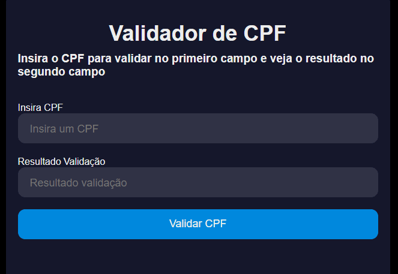

# Validate CPF 🛠

Check if a CPF is valid or not.

## 🚀 Technologies
- HTML
- CSS
- JavaScript

## ℹ Description/Important notes

It was a class that I learned about 'Class' in a course on the 'Udemy Courses', called "Curso de JavaScript e TypeScript do básico ao avançado 2021
" (JS and TS course from basic to advanced), done by the developer and mentor:
- Luiz Otávio Miranda 🧙‍♂️

I totally recommend this course if you want to learn principally about JS, node, typeScript and much more. Take a look on how many topics he teaches: https://www.udemy.com/course/curso-de-javascript-moderno-do-basico-ao-avancado/

My intention in this project was to learn how a CPF can be validated and practice Class on JavaScript.

I did just the "Controller", HTML and CSS, because the course doesn't have HTML and CSS classes. Check this out:

```javascript
/*
=========CONTROLLER==========
*/

const validateButton = document.querySelector('.submit');
const cpfSent = document.querySelector('.cpf');
const result = document.querySelector('.screen');

validateButton.addEventListener('click', () => {
  let newValidateCPF = new validateCPF(cpfSent.value);
  if(newValidateCPF.validate()){
    result.value = 'CPF VÁLIDO'
  }else {
    result.value = 'CPF INVÁLIDO'
  }
});
```

### The project working:

<h1>
  
</h1>

Well, it's not all about the project, but I just want to bring here what I did differently to practice what I have been learning.

## 📌 But what is CPF and how do you validate a CPF?
The CPF is the Individual Taxpayer Registry. It is a document made by Receita Federal (equivalent to IRS in USA) and it identifies taxpayers. </br>
The CPF is a unique number with 11 digits. </br>
</br>
To validate one CPF is necessary to calculate the 9 first numbers as you can see better here:
I will show an example:

CPF 705.484.450-52
First, it's necessary to get the nine first numbers and multiply:

<table>
<tr>
  <td>CPF</td>
  <td>MULTIPLIER</td>
  <td>RESULT</td>
</tr>
<tr>
  <td>7</td>
  <td>10</td>
  <td>70</td>
</tr>
<tr>
  <td>0</td>
  <td>9</td>
  <td>0</td>
</tr>
<tr>
  <td>5</td>
  <td>8</td>
  <td>40</td>
</tr>
<tr>
  <td>4</td>
  <td>7</td>
  <td>28</td>
</tr>
<tr>
  <td>8</td>
  <td>6</td>
  <td>48</td>
</tr>
<tr>
  <td>4</td>
  <td>5</td>
  <td>20</td>
</tr>
<tr>
  <td>4</td>
  <td>4</td>
  <td>16</td>
</tr>
<tr>
  <td>5</td>
  <td>3</td>
  <td>15</td>
</tr>
<tr>
  <td>0</td>
  <td>2</td>
  <td>0</td>
</tr>
<tr>
  <td>--</td>
  <td>--</td>
  <td>237 (sum of all results)</td>
</tr>
</table>

The calculus to get the first digit is: </br>
11 - (237 % 11) = 5 (First digit) </br>
If the number is greater than 9, we consider 0.
</br>
</br>
Now that we have the first digit, the second digit is the same thing, but the multiplier starts with the number 11:
<table>
<tr>
  <td>CPF</td>
  <td>MULTIPLIER</td>
  <td>RESULT</td>
</tr>
<tr>
  <td>7</td>
  <td>11</td>
  <td>77</td>
</tr>
<tr>
  <td>0</td>
  <td>10</td>
  <td>0</td>
</tr>
<tr>
  <td>5</td>
  <td>9</td>
  <td>45</td>
</tr>
<tr>
  <td>4</td>
  <td>8</td>
  <td>32</td>
</tr>
<tr>
  <td>8</td>
  <td>7</td>
  <td>56</td>
</tr>
<tr>
  <td>4</td>
  <td>6</td>
  <td>24</td>
</tr>
<tr>
  <td>4</td>
  <td>5</td>
  <td>20</td>
</tr>
<tr>
  <td>5</td>
  <td>4</td>
  <td>20</td>
</tr>
<tr>
  <td>0</td>
  <td>3</td>
  <td>0</td>
</tr>
<tr>
  <td>5</td>
  <td>2</td>
  <td>10</td>
</tr>
<tr>
  <td>--</td>
  <td>--</td>
  <td>284 (sum of all results)</td>
</tr>
</table>

The calculus to get the second digit is: </br>
11 - (284 % 11) = 2 (First digit) </br>
If the number is greater than 9, we consider 0.
</br>
</br>
Now we have both digits to check our CPF: </br>
First Digit = 5 </br>
Second Digit = 2 </br>
</br>

## 📝License
This project is under the MIT license. See the [LICENSE](https://choosealicense.com/licenses/mit/) for more information.

##

If you want to collaborate, to give some opinion, if you know a different way to do, or just want to make a new friend, than send me an e-mail or a message on my LinkedIn:
 <a href = "mailto:lucas.virolli2@gmail.com"></a>
 <a href="https://www.linkedin.com/in/lucasvirollidalbello/" target="_blank"></a> 

##

Made with much 💜 by Lucas Virolli 🙋‍♂️
